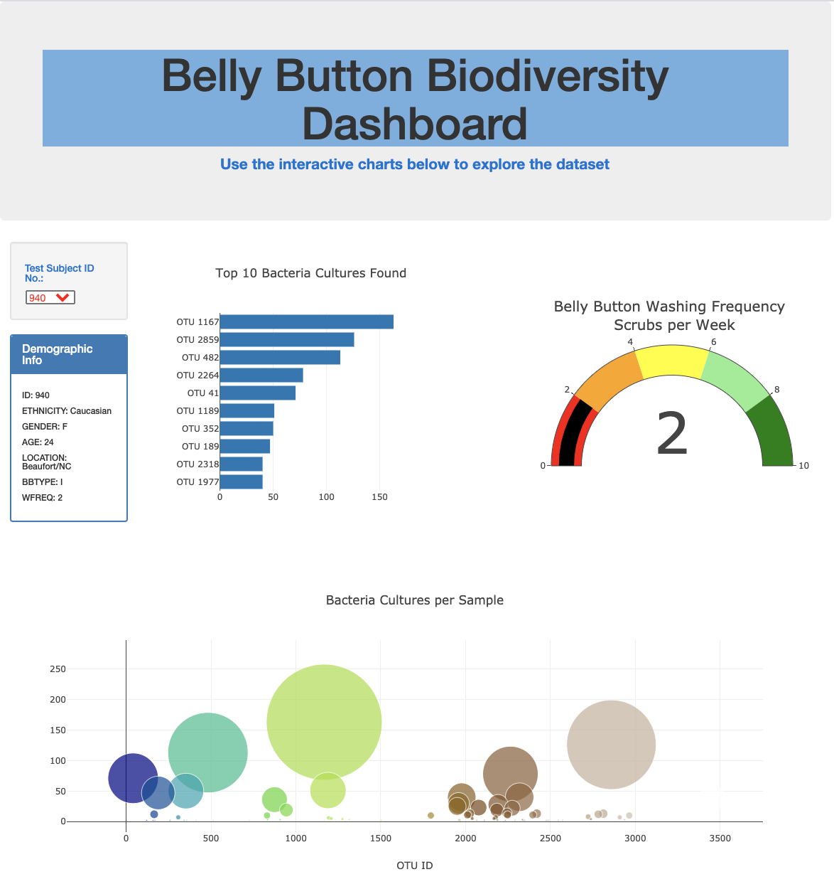

# **Module12-Plotly-Belly-Button-Biodiversity**
## **Plotly, Java Script, and HTML**

#### The purpose of this project is to  create an interactive dashboard that presents demographic information and bacteria data for each research volunteer by using HTML, Java Script, and Plotly.  The results of the research for each volunteer and his/her bacteria data are presented in a Demographic Info Panel and three different corresponding charts:

####    1. A Bar Chart that illustrates Top 10 bacteria cultures found in the belly button.
####    2. A Bubble Chart which displays the amount of bacteria cultures per sample.
####    3. A Gauge Chart that shows the belly button washing frequency scrubs per week.

#### To look for each participant's information and results, user can select the Test Subject ID Number from the dropdown menu and it will automatically update the Demographic Info and all three charts.

